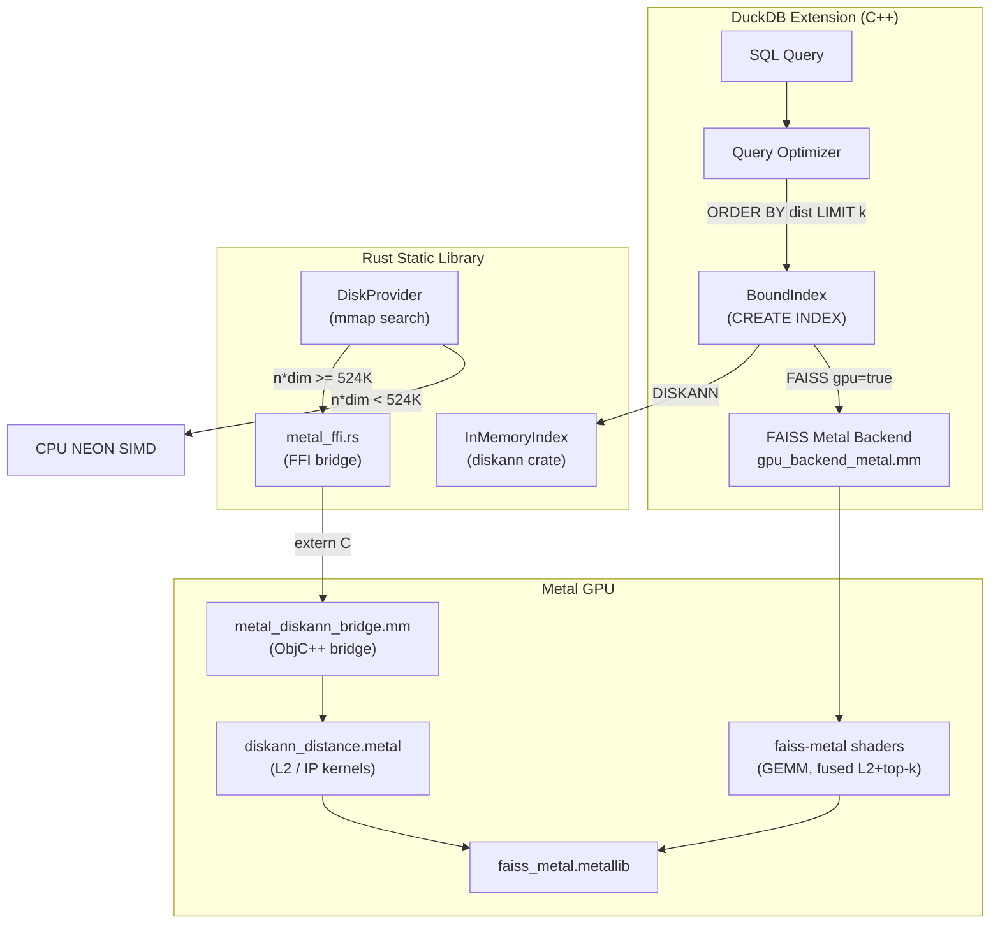

# ann — ANN Vector Indexes for DuckDB

DuckDB extension providing approximate nearest neighbor (ANN) vector indexes using **DiskANN** and **FAISS**. Indexes are stored inside the `.duckdb` file, survive restarts, and integrate with the query optimizer.

## Quick Start

```sql
-- Create a table with vector embeddings
CREATE TABLE docs (id INT, embedding FLOAT[384]);
INSERT INTO docs SELECT i, [random()::FLOAT for _ in range(384)] FROM range(10000) t(i);

-- Create an ANN index
CREATE INDEX docs_ann ON docs USING DISKANN (embedding);

-- Search automatically uses the index
SELECT id FROM docs ORDER BY array_distance(embedding, [0.1, 0.2, ...]::FLOAT[384]) LIMIT 10;
```

## Index Types

### DISKANN

Graph-based ANN index using the [DiskANN](https://github.com/microsoft/DiskANN) algorithm (Rust implementation). Good general-purpose choice.

```sql
CREATE INDEX idx ON table USING DISKANN (column) WITH (
    metric       = 'L2',    -- distance metric (L2 or IP)
    max_degree   = 64,      -- graph connectivity
    build_complexity = 128,  -- build-time search width (higher = better quality)
    alpha        = 1.2,      -- pruning expansion factor
    quantization = 'sq8'     -- optional: 8-bit scalar quantization (~4x memory reduction)
);
```

### FAISS

Wraps [FAISS](https://github.com/facebookresearch/faiss) indexes. Supports multiple index structures and optional GPU acceleration.

```sql
-- Flat (exact, no approximation)
CREATE INDEX idx ON table USING FAISS (column) WITH (type='Flat');

-- HNSW (graph-based, fast search)
CREATE INDEX idx ON table USING FAISS (column) WITH (type='HNSW', hnsw_m=32);

-- IVFFlat (inverted file, good for large datasets)
CREATE INDEX idx ON table USING FAISS (column) WITH (
    type='IVFFlat', ivf_nlist=100, nprobe=4, train_sample=50000
);

-- GPU-accelerated (Metal on macOS)
CREATE INDEX idx ON table USING FAISS (column) WITH (type='Flat', gpu=true);
```

| Option | Type | Default | Description |
|--------|------|---------|-------------|
| `metric` | VARCHAR | `'L2'` | `'L2'` or `'IP'` (inner product) |
| `type` | VARCHAR | `'Flat'` | `'Flat'`, `'HNSW'`, or `'IVFFlat'` |
| `hnsw_m` | INTEGER | 32 | HNSW graph connectivity |
| `ivf_nlist` | INTEGER | 100 | Number of IVF centroids |
| `nprobe` | INTEGER | 1 | IVF partitions to probe at search time |
| `train_sample` | INTEGER | 0 | Vectors for IVF training (0 = all) |
| `description` | VARCHAR | | FAISS `index_factory` string (advanced, overrides `type`) |
| `gpu` | BOOLEAN | false | Upload index to GPU for search |

## GPU Acceleration (Metal)

On macOS with Apple Silicon, the extension uses Metal GPU compute shaders for accelerated distance computation. Two acceleration paths exist:

### FAISS GPU

FAISS indexes support GPU-accelerated search. The GPU backend handles both `IndexFlat` and `IndexIVFFlat`.

```sql
-- Check GPU availability
SELECT * FROM faiss_gpu_info();
-- available | device
-- true      | Metal GPU (family=9)

-- Create a GPU-accelerated index
CREATE INDEX gpu_idx ON docs USING FAISS (embedding) WITH (gpu=true);
```

**How it works:**
- A CPU copy of the index is always maintained (for inserts and serialization)
- A GPU copy is lazily created on first search
- Inserts invalidate the GPU copy; it's rebuilt on the next search
- The `gpu` flag is persisted, so the index re-uploads on database reopen
- Falls back to CPU transparently if no GPU is available

### DiskANN Metal Distance

The disk-backed DiskANN search path (`DiskProvider`) can dispatch batch distance computations to the Metal GPU. This auto-activates when the batch is large enough to amortize GPU dispatch overhead (~450us per command buffer on Apple Silicon).

Currently effective for multi-query batching scenarios where many queries' neighbor distances are aggregated into a single GPU dispatch. Per-iteration graph traversal (32-128 neighbors) uses CPU NEON SIMD which is faster at those sizes.

### Metal Architecture



### Benchmark Results (Apple M1 Pro)

Batch L2 distance: one query vs N candidate vectors.

| n | dim | n*dim | CPU (us) | GPU no-copy (us) | GPU speedup |
|---|-----|-------|----------|-------------------|-------------|
| 64 | 128 | 8K | 4 | 448 | 0.01x |
| 64 | 768 | 49K | 53 | 453 | 0.12x |
| 128 | 1536 | 197K | 210 | 495 | 0.42x |
| 256 | 1536 | 393K | 424 | 415 | **1.02x** |
| 512 | 1536 | 786K | 870 | 380 | **2.29x** |
| 1024 | 768 | 786K | 784 | 532 | **1.47x** |

GPU wins at n*dim >= ~400K. DiskANN per-iteration batches (64-128 neighbors) are too small. Future work: aggregate distances from multiple concurrent queries into a single GPU dispatch.

**Requirements:** macOS with Apple Silicon, Xcode, `FAISS_METAL_ENABLED` (auto-detected at build time).

## Automatic Optimizer

Queries matching `ORDER BY distance_fn(col, query) LIMIT k` automatically use the index:

```sql
-- All of these use the index automatically:
SELECT * FROM docs ORDER BY array_distance(embedding, ?::FLOAT[384]) LIMIT 10;
SELECT * FROM docs ORDER BY array_inner_product(embedding, ?::FLOAT[384]) LIMIT 10;
SELECT * FROM docs ORDER BY array_cosine_similarity(embedding, ?::FLOAT[384]) LIMIT 10;
```

Supported distance functions: `array_distance`, `list_distance`, `array_inner_product`, `list_inner_product`, `array_cosine_similarity`, `list_cosine_similarity`.

When a `WHERE` clause is present, the optimizer overfetches (`3x + 100`) to compensate for post-filtering.

## Table Functions

### `ann_search` — Search with row fetch

```sql
SELECT * FROM ann_search('docs', 'docs_ann', [0.1, 0.2, ...]::FLOAT[384], 10);
-- Returns: all table columns + _distance, ordered by distance

-- Named parameters:
SELECT * FROM ann_search('docs', 'docs_ann', query, 10, search_complexity := 256, oversample := 3);
```

### `ann_search_batch` — Multi-query batch search

```sql
SELECT * FROM ann_search_batch('docs', 'docs_ann',
    [[0.1, 0.2, ...], [0.3, 0.4, ...]]::LIST(FLOAT[384]), 5);
-- Returns: query_idx, table columns, _distance
```

### `diskann_index_scan` / `faiss_index_scan` — Low-level index scan

```sql
SELECT row_id, distance FROM diskann_index_scan('docs', 'docs_ann', [0.1, ...]::FLOAT[384], 10);
-- Returns: (BIGINT row_id, FLOAT distance)
```

### `ann_list` / `ann_index_info` — Diagnostics

```sql
SELECT * FROM ann_list();
-- name | engine  | table_name

SELECT * FROM ann_index_info();
-- name | engine | table_name | num_vectors | num_deleted | memory_bytes | quantized
```

### `diskann_streaming_build` — Build from binary file

Two-pass streaming build for datasets larger than RAM:

```sql
SELECT * FROM diskann_streaming_build('/tmp/vectors.bin', '/tmp/index.diskann',
    metric := 'l2', max_degree := 64, sample_size := 10000);
```

Input format: `[u32 num_vectors][u32 dimension][f32 * N * D]` (little-endian).

## Building

```bash
# Clone with submodules
git clone --recursive https://github.com/decisiongraph/duckdb-ann
cd duckdb-ann

# Build (DiskANN always, FAISS if available)
make release GEN=ninja

# Run tests
make test
```

**Requirements:** C++17 compiler, CMake, Rust toolchain. Optional: FAISS (`-DENABLE_FAISS=ON`), Metal GPU support.

If using [devenv](https://devenv.sh/), `devenv shell` provides all dependencies.
